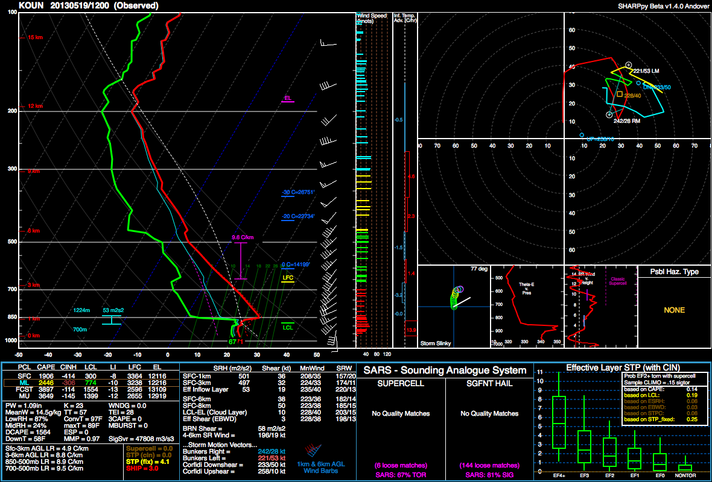

.. SHARPpy documentation master file, created by
   sphinx-quickstart on Tue Nov 20 21:59:30 2018.
   You can adapt this file completely to your liking, but it should at least
   contain the root `toctree` directive.

Welcome to SHARPpy's documentation!
===================================

:Release: |version|
:Date: |today|

:command:`This documentation describes the released Andover branch of SHARPpy.`

SHARPpy is a collection of open source sounding and hodograph analysis routines, a sounding plotting package, and an interactive, *cross-platform* application for analyzing real-time soundings all written in Python. It was developed to provide the atmospheric science community a free and consistent source of sounding analysis routines. SHARPpy is constantly updated and vetted by professional meteorologists and climatologists within the scientific community to help maintain a standard source of sounding routines.

We currently support Python >= 3.6.

Noteable Links
==============
* A `blog post <http://www.pmarshwx.com/blog/2012/01/11/sharppy-preview-ams-presentation/>`_ on SHARPpy from Patrick Marsh.
* The `original SHARPpy presentation at AMS 2012 <https://ams.confex.com/ams/92Annual/webprogram/Paper203274.html>`_.
* The `updated SHARPpy paper <https://www.google.com/url?sa=t&rct=j&q=&esrc=s&source=web&cd=7&ved=2ahUKEwjRz8W7vKzfAhWQrFkKHYhpCQcQFjAGegQIAhAC&url=https%3A%2F%2Fams.confex.com%2Fams%2F95Annual%2Fwebprogram%2FManuscript%2FPaper270233%2Fsharppy_extended_abstract_draft1.pdf&usg=AOvVaw0VseR0-3VG15NyJd-Oi1Vk>`_ from AMS 2015.
* The `BAMS article on SHARPpy <https://journals.ametsoc.org/doi/10.1175/BAMS-D-15-00309.1>`_ released in 2017.
* `Google Scholar <https://scholar.google.com/scholar?start=0&q=%22SHARPpy%22&hl=en&as_sdt=0,21>`_ search for papers that use SHARPpy. 

.. toctree::
   :maxdepth: 1
   :hidden:

   license
   changelog
   install
   picker
   interpreting_gui
   insets
   interacting_gui
   SHARPpy_basics
   datasource_guide
   scripting
   auto_examples/index
   contributing
   citing

Indices and tables
==================

* :ref:`genindex`
* :ref:`modindex`
* :ref:`search`

