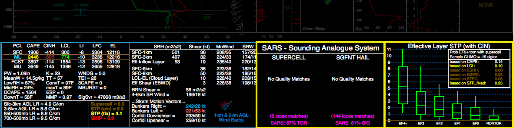
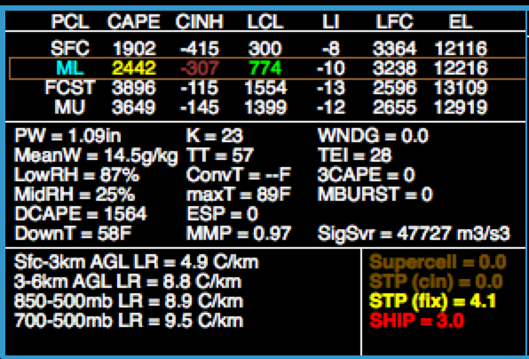
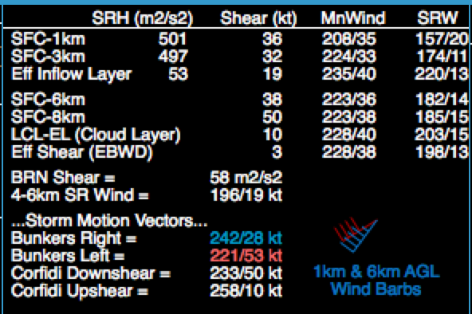
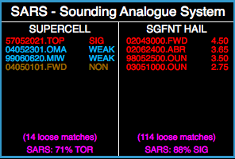
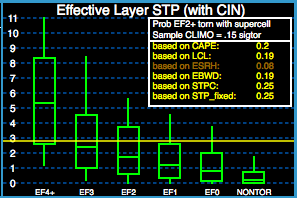
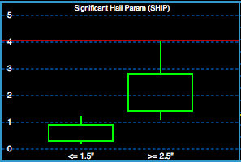
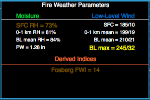
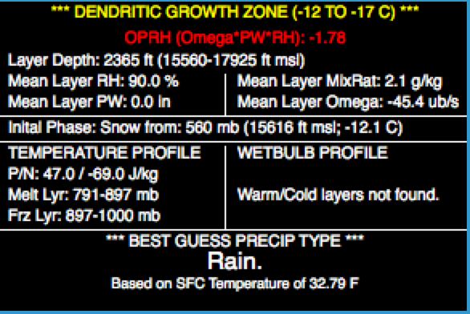
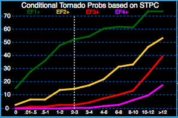
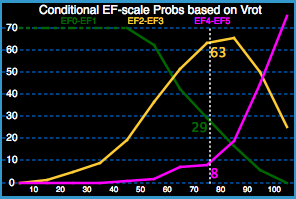

.. _Insets_:

Interpreting the Insets
=======================

At the bottom of the SHARPpy GUI lies four separate insets that can be used to assist in analyses of the sounding data.  The two insets highlighted in yellow are interchangeable with some of the other insets provided in the program.  Right clicking either inset will bring up a menu that shows the other insets that can be swapped with the selected one.

Thermodynamic Indices
^^^^^^^^^^^^^^^^^^^^^

* Shows four parcels that were lifted in the sounding and their various properties (e.g., CAPE, CIN, LCL, LFC, EL).
* Displays the lapse rate for various layers key for deep, moist convection forecasting
* Provides an array of indices that describes water vapor in the atmosphere and severe convection potential.

Kinematic Indices
^^^^^^^^^^^^^^^^^

* Provides information on the storm-relative helicity (SRH), wind shear (Shear), pressure-weighted mean wind (MnWind) and layer-averaged storm-relative winds (SRW) for different layers. 
* Layers shown here have been shown to correspond to storm longevity, storm mode, and tornado potential. 
* The Bunkers storm motion and Corfidi vectors are also displayed.

Sounding Analog Retrieval System (SARS)
^^^^^^^^^^^^^^^^^^^^^^^^^^^^^^^^^^^^^^^

    Sounding Analogue Retrieval System to compare soundings with previous severe weather environments.

Sounding Analog Retrieval System matches the indices of the current sounding to those from past severe weather events within the CONUS (see `Jewell et al. <http://www.spc.noaa.gov/publications/jewell/sars.pdf>`_).  

* Clicking on any of the close matches will load the sounding from that event into the sounding window for closer comparison and inspection.  
* Atempts to find "loose" matches between the current sounding to past tornado and hail events using sounding parameters. 
* “Loose” matches are used to provide a probability of hail exceeding 2 inches and a tornado intensity exceeding EF2.  This algorithm is calibrated to maximize probability of detection of these events.
* When the indices reach very large values (e.g., SBCAPE > 6000 J/kg), SARS may fail to provide a good prediction as extreme values are rare within the SARS database.

Strict (very close) matches are also displayed showing the date, time, location, and threat magnitude:

* Supercells may have no tornado (NON), a weak tornado (WEAK) or a significant tornado (EF2+) (SIG).
* Hail size is indicated in the strict matches.

Sig-Tor Stats
^^^^^^^^^^^^^

    STP Ingredients and EF Probabilties for diagnosing tornadic environment ingredients.

Information on the significant tornado parameter with CIN (STPC) associated with the sounding (see `Thompson et al. 2012, WAF <http://www.spc.noaa.gov/publications/thompson/waf-env.pdf>`_).  Distributon of STP (effectve-layer) with tornado intensity for right-moving supercells. Whiskers indicate 10th-90th percentile values, while the box indicates the interquartile range and the median. Colored horizontal line indicates the value of STPE.

The smaller inset embedded within this one indicates the relative frequency of EF2+ tornado damage with right moving supercells for STPE and its individual components (e.g., MLLCL, MLCAPE, EBWD, ESRH). Frequency values change color (similar to the Thermodynamic inset) as the probability increases.

Sig-Hail Stats
^^^^^^^^^^^^^^

    Expected Hail Sizes based on the SHIP parameter using a hail climatology.

Distribution of expected hail sizes associated with the significant hail parameter (SHIP).

Fire Weather
^^^^^^^^^^^^

    Fire weather parameters and guidance.

* Provides a list of variables relevant to the moisture and wind properties within the convective boundary layer.  
* See Fosberg (1978) for information on the Fosberg Fire Weather Index (FWI).  
* PW changes color if the MUCAPE > 50 J/kg, PW < 0.5 inches, and SFC RH is < 35 % to alert the user if the potential exists for fire starting, dry thunderstorms.

Winter Weather
^^^^^^^^^^^^^^

* Provides information regarding the mean atmospheric properties within the Dendritic Growth Zone (DGZ; -12  ̊C to -17  ̊C layer), which is the layer where most types of ice nuclei can become activated and grow into ice crystals (e.g., snow).
* Provides an estimate of the initial precipitation phase using empirical arguments.
* Identifies layers where falling precipitation may experience melting/freezing by considering the wetbulb temperature profile and environmental temperature profile.
* Performs a best guess precipitation type using `Bourgouin (2000) <https://journals.ametsoc.org/doi/10.1175/1520-0434%282000%29015%3C0583%3AAMTDPT%3E2.0.CO%3B2>`_ precipitation algorithm, the initial precipitation phase, and surface temperature.
* Uses top-down preciptation thinking to determine precipitation type.

EF Scale Probablities (STP)
^^^^^^^^^^^^^^^^^^^^^^^^^^^

    Conditional probability of meetingng or exceeding a given EF scale rating for max STP (effective-layer w/ CIN) within 80 km of a tornado (all convective mode events).

Conditional probablities for different tornado strengths based on STPC (see `Smith et al. 2015, WAF <http://www.spc.noaa.gov/publications/smith/vrot-env.pdf>`_). Applies only if a tornado is present.

EF Scale Probablities (VROT)
^^^^^^^^^^^^^^^^^^^^^^^^^^^^

    Conditional WSR-88D 0.5 Deg. Azimuthal Shear Tornado Intensity Probabilities

Conditional probabilities for different tornado strengths based on the 0.5 degree rotational velocity. (Double click inside the inset to input a VROT value...see `Smith et al. 2015, WAF <http://www.spc.noaa.gov/publications/smith/vrot-env.pdf>`_).  The inset assesses the conditional probability of maximum tornado EF scale by combining information on the near-storm environment, the convective mode, and the 0.5 ̊ peak VROT (from WSR-88D).

