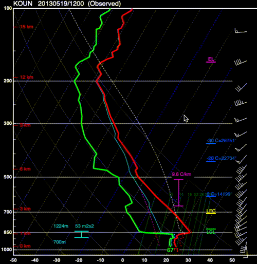
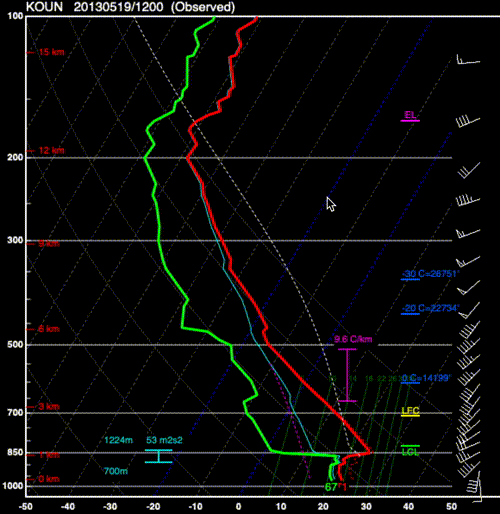
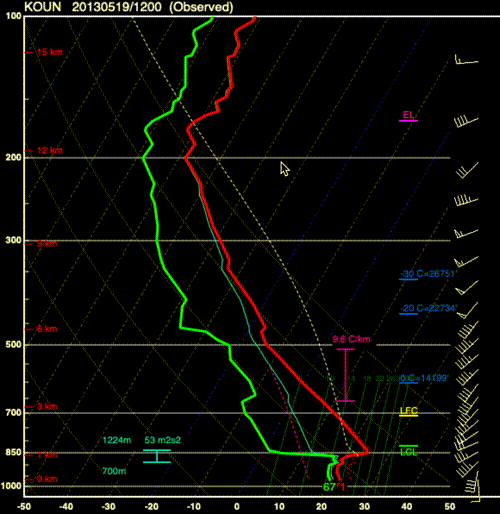
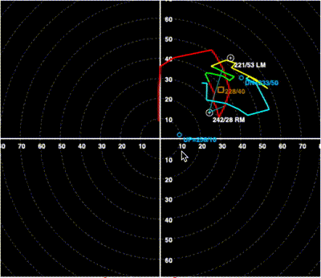
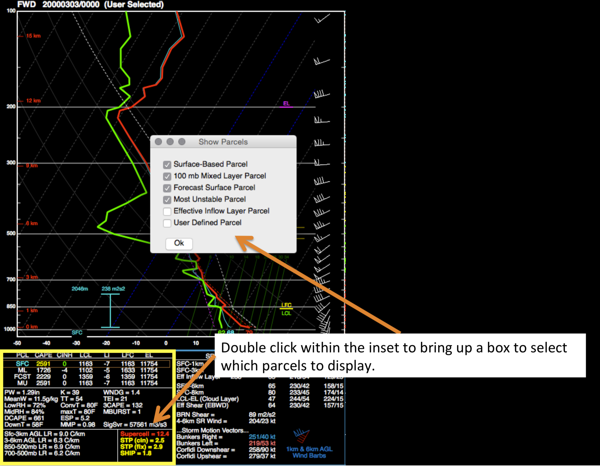

.. _Interacting_with_the_GUI:

Interacting with the GUI
========================

For information on the interactive aspects of the program, see the sections below:

Printing out values
-------------------

Right clicking on the Skew-T will enable you to switch to the Readout Cursor.  As you move your cursor
up and down along the Skew-T, readouts will show you the values of different variables of the sounding.  
The variables shown by the Readout cursor can be changed in the Preferences window.  Variables that can be
printed out by the Readout cursor include temperature, dewpoint, potential temperature, water vapor
mixing ratio, equivalent potential temperature, vertical velocity, and wetbulb temperature. 

The Readout Cursor also shows the location of the cursor on the hodograph 
along with the wind speed and direction (not shown here).

Changing preferences
--------------------------

Users may select "Preferences" using the menu bar of the SHARPpy program.  Doing so will load a small window where the user can modify the SHARPpy color pallet and the units of the program.  Currently, the three color pallets exist: the Standard (black background), Inverted (white background), or the Protanopia (for color blindness).  

Units may be changed for the surface temperature value, the winds, and the precipitble water vapor.  Switching to metric units through this method may help international users more easily use the program.  These changes may be detected in the GUI, as various locations where the units are shown will switch when a new unit is selected in the Preferences. 

Zooming and Changing Views
--------------------------

Your mouse wheel or trackpad will allow you to zoom on both the Hodograph and Skew-T plots within the window.  Right clicking on the Hodograph will also allow you to change where the hodograph is centered.  Currently, the hodograph can be centered on the Right Mover Storm Motion Vector, the Cloud-Layer Mean Wind Vector, or the origin of the hodograph.

Color Ranking
-------------

The GUI uses color to highlight the features a forecaster ought to look at.  Most indices have a color ranking and thresholds using these colors (1, very high values to 6, very low values).  Generally, brighter colors indicate larger values, such as those in the traditional SHARP color palette.  

The precipitable water (PW) value in the sounding window follows a different color scale, as it is based upon the precipitable water vapor climatology for each month (donated by `Matthew Bunkers; NWS <https://www.weather.gov/unr/uac>`_.  Green colors means that the PW value is moister than average, while brown values mean the PW value is drier than average.  The intensity of the color corresponds to how far outside the PW distribution the value is (by standard deviation). NOTE: This function only works for current US radiosonde stations.

Modifying the Data
-------------------

The sounding that is in focus can be modified by clicking and dragging the points of the temperature/dewpoint/hodograph lines.  Recalculations of all indices will take place when this is done.  

To speed up the editing process, the profile can be interpolated to 25-mb intervals.  This can be done by either pressing the 'I' key on the keyboard or by selecting Profiles->Interpolate on the menu bar. Interpolating the profile will take into account any modifications you've done to the original profile.  Pressing the 'I' key again or selecting Profiles->Reset Interpolation will reset the profile, undoing all modifications, so be sure you want to reset the profile before doing so.

    This animation shows an example of the profile being interpolated to 25-mb intervals and then the dewpoint profile being modified.

In addition, the surface properties of the sounding can also be modified.  By right clicking on the Skew-T diagram, select Modify Surface.  This will create a popup box where you can alter the surface thermodynamic properties.  If the "Mix" box is checked, the surface values will be mixed upwards in the sounding to generate a surface-based mixed layer.  Should a superadiabatic contact layer be needed, the Modify Surface operation can be repeated again.

    An example of the surface properties being modified within the SHARPpy GUI.

To reset the Skew-T or hodograph back to the original data, right click on either the Skew-T or the hodograph and click "Reset Skew-T" or "Reset Hodograph".

Determining Storm Mode
----------------------

The hodograph may be modified in SHARPpy to better understand the storm mode that can be expected from the focused sounding.

First, either Bunkers storm motion vector plotted on the hodograph may be selected by double clicking the RM or LM cross hairs.
This will change the storm motion vector used to calculate various storm-motion vector dependent functions in SHARPpy
(e.g., Storm Slinky, storm relative helicity).  In addition, the storm motion vectors may be modified by clicking and dragging 
the markers to their new location on the hodograph.  Modifying the location will also force a re-calculation of the SHARPpy indices.
 
Seconds, the Boundary Cursor may be used to plot a boundary on the hodograph in order to determine how long convective updrafts may stay within a zone of ascent provided by a boundary.  Clicking on the hodograph with the Boundary Cursor will plot a boundary in orange on the hodograph and will also plot the 0-6 km shear (blue) and the 9-11 km storm relative wind (pink) vectors on the hodograph.  This allows you to visualize if the environment is favorable for storms growing upscale via the work done in `Dial et al. 2010, WAF <http://www.spc.noaa.gov/publications/dial/waf-mode.pdf>`_.  Clicking on the hodograph again will remove the boundary.

    
    Animation showing how to select and place the boundary on the hodograph.

Lifting Parcels
---------------

By default, soundings opened up in the GUI show these 4 parcels in the lower left inset window:

1. Surface-based Parcel
2. 100 mb Mixed-layer Parcel
3. Forecasted Surface Parcel
4. Most-Unstable Parcel

Double clicking on this inset will allow you to swap out these parcels for two others:

1. Effective Inflow Layer Mean Parcel
2. User Defined Parcel

The current parcel shown in the Skew-T is highlighted by a brown box within the Thermo inset.  Clicking on any of the 4 parcels in the inset will change the parcel trace drawn on the Skew-T and b) change the parcel used in the parcel trajectory calculation (aka Storm Slinky.)  To lift custom parcels, double click on the Thermo (lower left) inset and select the "User Parcel".  Then, right click on the Skew-T and select the "Readout Cursor".  Once you find the location in your profile you wish to lift, right click again and look under the "Lift Parcel" menu to select a parcel lifting routine.  If you are lifting a layer averaged parcel, the location of the cursor selects the level (or bottom of the layer) you are lifting.

Interacting with Multiple Soundings
-----------------------------------

After adding other soundings into the sounding window by using the Sounding Picker,
the user can change which sounding is the "focus" by accessing the list of available
profiles.  This list is kept underneath the "Profiles" menu on the menu bar.   SHARPpy keeps track of the time aspect of all data loaded into the sounding window and attempts to show all profiles valid at a given time.  For the given sounding source that is in focus, the right and left buttons on your keyboard will step through the data in time and will attempt to show any other data sources available.  When observed or user selected data is loaded into the sounding window, SHARPpy will not overlay soundings from different times unless the "Collect Observed" function is checked.  This can be accessed through underneath the "Profiles" menu item or by pressing "C" on your keyboard.

The space bar on your keyboard is used to swap the focus between the profiles shown in the sounding window.  Additionally, to swap between the SHARPpy Sounding Picker and sounding window, hit "W" on your keyboard.  With this change, the right and left arrow keys now will step through the profiles available from the sounding data source that is active.  SHARPpy will automatically match up the soundings in time.

Saving the Data
---------------

When the sounding window is up, you can select to either save the sounding as an image or save the current focused sounding as a text file that can be loaded back into SHARPpy.  These functions are found underneath the File->Save Text or File->Save Image functions.  "Save Text" will save the current sounding shown in the GUI to an SPC tabular-formatted text file.

