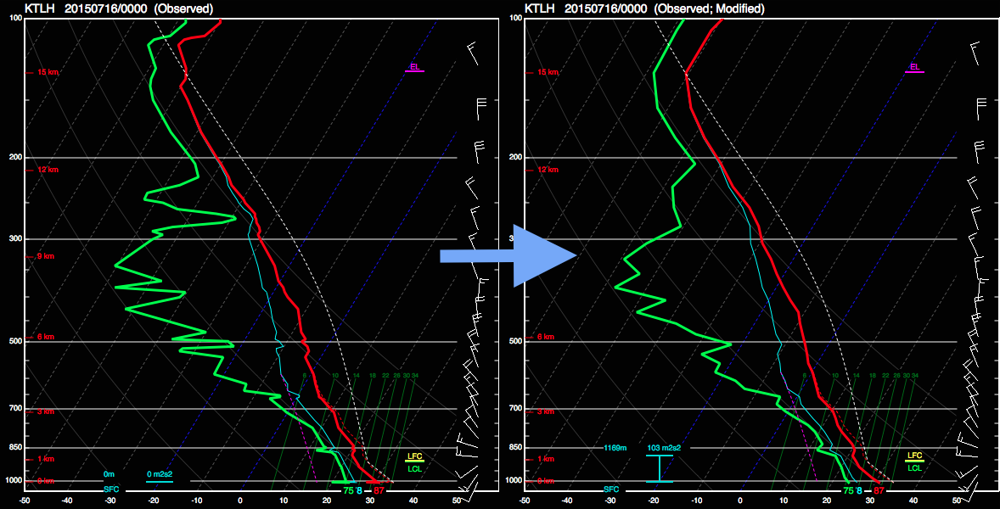

.. _Interacting_with_the_GUI:

Interacting with the GUI
========================

For information on the interactive aspects of the program, see the sections below:

Zooming and Changing Views
--------------------------

Your mouse wheel or trackpad will allow you to zoom on both the Hodograph and Skew-T plots within the window.  Right clicking on the Hodograph will also allow you to change where the hodograph is centered.  Currently, the hodograph can be centered on the Right Mover Storm Motion Vector, the Cloud-Layer Mean Wind Vector, or the origin of the hodograph.

Swapping Insets
---------------

The right 2 insets of the SHARPpy program can be changed by right clicking on either one.  Right clicking will bring up a menu that shows the different insets available for the user.  These insets exist to help the user further interrogate the data.  Below is a list of the current available insets:

1. SARS - Sounding Analog Retrieval System provides matching of the current sounding to past severe weather events.  Clicking on any of the close matches will load the sounding from that event into the sounding window for closer comparison and inspection (see [Jewell et al.](http://www.spc.noaa.gov/publications/jewell/sars.pdf)).
2. STP STATS - Information on the significant tornado parameter with CIN (STPC) associated with the sounding (see [Thompson et al. 2012, WAF](http://www.spc.noaa.gov/publications/thompson/waf-env.pdf)).
3. SHIP - Distribution of expected hail sizes associated with the significant hail parameter (SHIP).
4. STP COND - Conditional probablities for different tornado strengths based on STPC (see [Smith et al. 2015, WAF](http://www.spc.noaa.gov/publications/smith/vrot-env.pdf)).
5. WINTER - Information on precipitation type, melting and freezing in the profile, and the dendritic growth zone.
6. FIRE - Fire weather information such as wind speed and humidity in the boundary layer.
7. VROT - Conditional probabilities for different tornado strengths based on the 0.5 degree rotational velocity. (Double click inside the inset to input a VROT value...see [Smith et al. 2015, WAF](http://www.spc.noaa.gov/publications/smith/vrot-env.pdf))

Color Ranking
-------------

The GUI uses color to highlight the features a forecaster ought to look at.  Most indices have a color ranking and thresholds using these colors (1, very high values to 6, very low values):

1. MAGENTA
2. RED
3. YELLOW
4. WHITE
5. LIGHT BROWN
6. DARK BROWN

The precipitable water (PW) value in the sounding window follows a different color scale, as it is based upon the precipitable water vapor climatology for each month (donated by [Matthew Bunkers; NWS](https://www.weather.gov/unr/uac)).  Green colors means that the PW value is moister than average, while brown values mean the PW value is drier than average.  The intensity of the color corresponds to how far outside the PW distribution the value is (by standard deviation). NOTE: This function only works for current US radiosonde stations.

Interacting with the Focused Sounding
-------------------------------------

The current sounding that is in "focus" in the program has the traditional "red/green" temperature and dewpoint profiles, while all other soundings in the background will be colored purple.  Below are some functions of the sounding window that are specific to the sounding that is in focus.

Modifying the Sounding
----------------------

The sounding that is in focus can be modified by clicking and dragging the points of the temperature/dewpoint/hodograph lines.  Recalculations of all indices will take place when this is done.  To reset the Skew-T or hodograph back to the original data, right click on either the Skew-T or the hodograph and look for the option to reset the data.

New in version 1.3.0 is the ability to interpolate the profile to 25-mb intervals.  This can be done by either pressing the 'I' key on the keyboard or by selecting Profiles->Interpolate on the menu bar. Interpolating the profile will take into account any modifications you've done to the original profile.  Pressing the 'I' key again or selecting Profiles->Reset Interpolation will reset the profile, undoing all modifications, so be sure you want to reset the profile before doing so.

    Example interpolation of the sounding profile from the high-resolution (left) to the interpolated (right).

Storm Mode Functions
--------------------

Right clicking on the hodograph will open up a menu that includes some functions that allow further inspection of the type of storm mode that can be expected from the focused sounding.  In particular, the Storm Motion Cursor and the Boundary Cursor can be used.  Using the Storm Motion Cursor will allow you to determine the 0-1 km, 0-3 km, and effective storm-relative helicity for differen storm motions than the supercell right mover motion plotted on the hodograph.  The Boundary Cursor, allows you to plot a boundary on the hodograph in order to determine how long convective updrafts may stay within a zone of ascent.  Clicking on the hodograph with the Boundary Cursor will plot a boundary in orange on the hodograph and will also plot the 0-6 km shear (blue) and the 9-11 km storm relative wind (pink) vectors on the hodograph.  This allows you to visualize if the environment is favorable for storms growing upscale via the work done in [Dial et al. 2010, WAF](http://www.spc.noaa.gov/publications/dial/waf-mode.pdf).  Clicking on the hodograph again will remove the boundary.

Lifting Parcels
---------------

By default, soundings opened up in the GUI show these 4 parcels in the lower left inset window:

1. Surface-based Parcel
2. 100 mb Mixed-layer Parcel
3. Forecasted Surface Parcel
4. Most-Unstable Parcel

Double clicking on this inset will allow you to swap out these parcels for two others:

1. Effective Inflow Layer Mean Parcel
2. User Defined Parcel

The current parcel shown in the Skew-T is highlighted by a brown box within the Thermo inset.  Clicking on any of the 4 parcels in the inset will change the a) the parcel trace drawn on the Skew-T and b) change the parcel used in the parcel trajectory calculation (aka Storm Slinky.)  To lift custom parcels, double click on the Thermo (lower left) inset and select the "User Parcel".  Then, right click on the Skew-T and select the "Readout Cursor".  Once you find the location in your profile you wish to lift, right click again and look under the "Lift Parcel" menu to select a parcel lifting routine.  If you are lifting a layer averaged parcel, the location of the cursor selects the level (or bottom of the layer) you are lifting.

Saving the Data
---------------

When the sounding window is up, you can select to either save the sounding as an image or save the current focused sounding as a text file that can be loaded back into SHARPpy.  These functions are found underneath the File->Save Text or File->Save Image functions.

Interacting with Multiple Soundings
-----------------------------------

After adding other soundings into the sounding window, the user can change which sounding is the "focus" by accessing the list of available profiles.  This list is kept underneath the "Profiles" menu on the menu bar.   SHARPpy keeps track of the time aspect of all data loaded into the sounding window and attempts to show all profiles valid at a given time.  For the given sounding source that is in focus, the right and left buttons on your keyboard will step through the data in time and will attempt to show any other data sources available.  When observed or user selected data is loaded into the sounding window, SHARPpy will not overlay soundings from different times unless the "Collect Observed" function is checked.  This can be accessed through underneath the "Profiles" menu item or by pressing "C" on your keyboard.

The space bar on your keyboard is used to swap the focus between the profiles shown in the sounding window.  Additionally, to swap between the SHARPpy Sounding Picker and sounding window, hit "W" on your keyboard.  With this change, the right and left arrow keys now will step through the profiles available from the sounding data source that is active.  SHARPpy will match up other.
