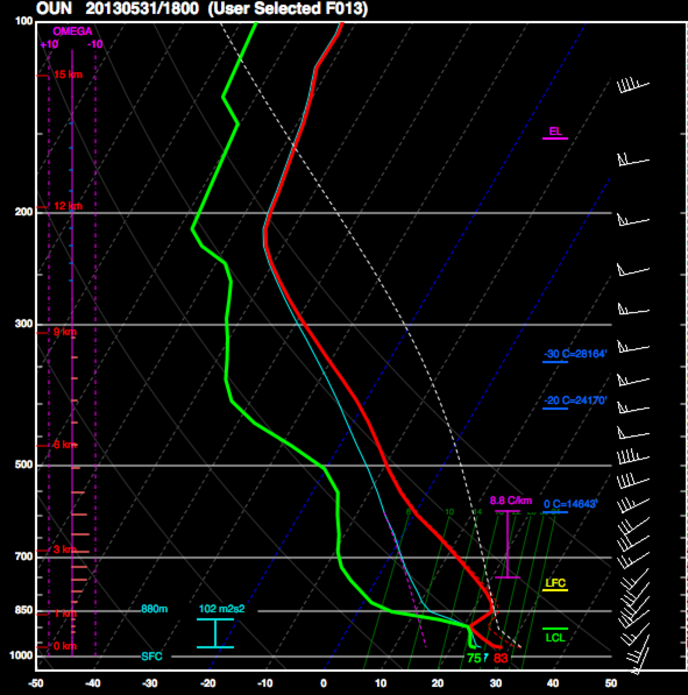
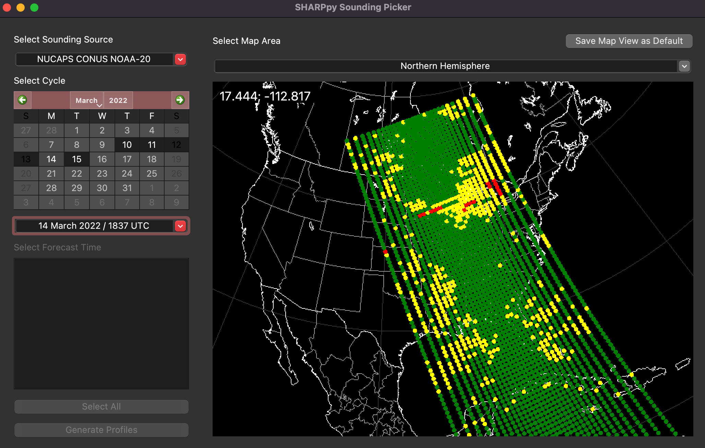
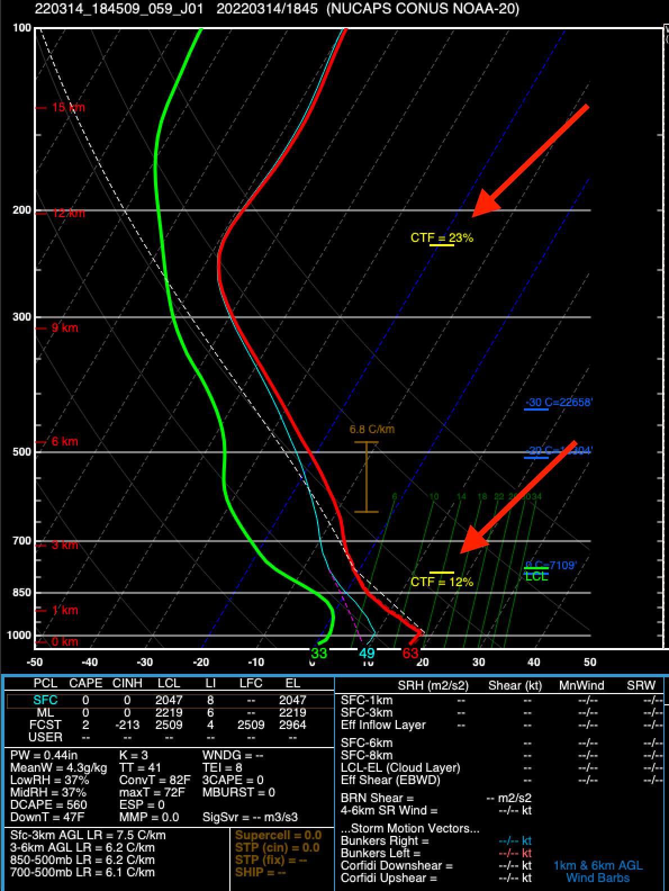

.. _Interpreting_with_the_GUI:

.. raw:: html

    

.. role:: red
.. role:: green
.. role:: cyan
.. role:: purple
.. role:: blue
.. role:: yellow

Interpreting the GUI
========================

Our `BAMS article <http://journals.ametsoc.org/doi/abs/10.1175/BAMS-D-15-00309.1>`_ on SHARPpy provides an overview of the various insets and information included in the SHARPpy sounding window.  Included within the paper is a list of references to journal articles which describe the relevance of each aspect of the SHARPpy sounding window to research in atmospheric science and the scientific forecasting process.  This documentation repeats some of the information included in the BAMS article and describes the various parts of the SHARPpy GUI.

Additional resources for interpreting the GUI include the `SPC Sounding Analysis Help <http://www.spc.noaa.gov/exper/soundings/help/>`_ and `Explanation of SPC Severe Weather Parameters <http://www.spc.noaa.gov/sfctest/help/sfcoa.html>`_ webpages.  The first site describes the SHARP GUI, which is the basis for the SHARPpy GUI.  The second can be used to help interpret some of the various convection indices shown in the SHARPpy GUI.  Not all features shown on these two sites are shown in the SHARPpy GUI.

Skew-T
------

Various sounding variables are displayed in the Skew-T, which is a central panel of the GUI:

    * Solid :red:`red` – temperature profile
    * Solid :green:`green` – dewpoint profile
    * Dashed :red:`red` – virtual temperature profile.
    * Solid :cyan:`cyan` – wetbulb temperature profile
    * Dashed white – parcel trace (e.g., MU, SFC, ML) (the parcel trace of the parcel highlighted in yellow in the Thermodynamic Inset.)
    * Dashed :purple:`purple` – downdraft parcel trace (parcel origin height is at minimum 100-mb mean layer equivalent potenial temperature).
    * Winds barbs are plotted in knots (unless switched to m/s in the preferences) and are interpolated to 50-mb intervals for visibility purposes.
    * If a vertical velocity profile (omega) is found (e.g., sounding is from a model), it is plotted on the left. :blue:`Blue` bars indicate sinking motion, :red:`red` bars rising motion. Dashed :purple:`purple` lines indicate the bounds of synopic scale vertical motion.  Units of the vertical velocity are in microbars/second.

.. note::
    When analyzing model forecast soundings, the omega profile can be used to determine whether or not models are "convectively contaminated".  This phrase means that the sounding being viewed is under the influence of convection and therefore is not representitive of the large-scale environment surrounding the storm.  When omega values become much larger than synoptic scale vertical motion values, users should take care to when interpreting the data.

Parcel LCL, LFC, and EL are denoted on the right-hand side in :green:`green`, :yellow:`yellow` and :purple:`purple`, respectively.  Levels where the environmental temperature are 0, -20, and -30 C are labeled in dark blue.  The :cyan:`cyan` and :purple:`purple` I-bars indicate the effective inflow layer and the layer with the maximum lapse rate between 2-6 km AGL.  Information about the effective inflow layer may be found in `Thompson et al. 2007 <https://www.spc.noaa.gov/publications/thompson/effective.pdf>`_.

    An example of the Skew-T inset showing a model forecast sounding for May 31, 2013 at 18 UTC.  The 2-6 km max lapse rate layer clearly denotes the elevated mixed layer, while the omega profile indicates that rising motion is occuring within the lowest 6 km of the sounding in the forecast.

If the Winter inset is selected, SHARPpy will label the the dendritic growth zone (DGZ), the wet-bulb zero (WBZ), and the freezing level (FRZ) on the Skew-T diagram.  If the Fire inset is selected, the convective boundary layer top will be denoted on the Skew-T.

Wind Speed Profile
------------------

    The tick marks for this plot are every 20 knots (should knots be the default unit selected in the preferences).

Inferred Temperature Advection Profile
--------------------------------------

Hodograph
---------

Although the hodograph plotted follows the traditional convention used throughout meteorology, the hodograph shown here is broken up into layers by color.  In addition, several vectors are also plotted from different SHARPpy algorithms.

Bunkers Storm Motion Vectors
^^^^^^^^^^^^^^^^^^^^^^^^^^^^

.. figure:: tutorial_imgs/hodograph_bunkers.png
    :scale: 30%
    :align: center

The storm motion vectors here are computed using the updated `Bunkers et al. 2014 <http://www.weather.gov/media/unr/soo/scm/2014-JOM11.pdf>`_ algorithm, which takes into account the effective inflow layer.

Corfidi Vectors
^^^^^^^^^^^^^^^

.. figure:: tutorial_imgs/hodograph_corfidi.png
    :scale: 30%
    :align: center

The Corfidi vectors may be used to estimate mesoscale convective system (MCS) motion.  See `Corfidi 2003 <https://www.spc.noaa.gov/publications/corfidi/mcs2003.pdf>`_ for more information about how these are calculated.

LCL-EL Mean Wind
^^^^^^^^^^^^^^^^

.. figure:: tutorial_imgs/hodograph_mean_wind.png
    :scale: 30%
    :align: center

Critical Angle
^^^^^^^^^^^^^^

See `Esterheld and Guiliano 2008 <http://www.ejssm.org/ojs/index.php/ejssm/article/view/33>`_ for more information on the use of critical angle in forecasting.

Storm Slinky
------------

.. image:: tutorial_imgs/slinky_description.png
    :scale: 30%
    :align: center

Examples
^^^^^^^^

.. image:: tutorial_imgs/slinky_supercell.png
    :scale: 30%
    :align: center

.. image:: tutorial_imgs/slinky_single_cell.png
    :scale: 30%
    :align: center

.. image:: tutorial_imgs/slinky_warning.png
    :scale: 30%
    :align: center

Theta-E w/ Pressure
-------------------

See `Atkins and Wakimoto 1991 <https://journals.ametsoc.org/doi/pdf/10.1175/1520-0434%281991%29006%3C0470%3AWMAOTS%3E2.0.CO%3B2>`_ for more information on what to look for in this inset when forecasting wet microbursts.

Storm-Relative Winds w/ Height
------------------------------

See `Rasmussen and Straka 1998 <https://journals.ametsoc.org/doi/pdf/10.1175/1520-0493%281998%29126%3C2406%3AVISMPI%3E2.0.CO%3B2>`_ for more information on how the anvil-level storm relative winds may be used to predict supercell morphology.  See `Thompson et al. 2003 <https://www.spc.noaa.gov/publications/thompson/ruc_waf.pdf>`_ for information on using the 4-6 km storm-relative winds to predict tornado environments.

Possible Hazard Type
--------------------

Flowchart
^^^^^^^^^

.. image:: tutorial_imgs/pht_flowchart.png
    :scale: 30%
    :align: center

NUCAPS
--------------------
The NOAA Unique Combined Atmospheric Processing System (NUCAPS) profiles are available twice a day using infrared and microwave sounders on board several polar orbiting satellites. NUCAPS measures vertical profiles of temperature, humidity, and trace gas concentrations. Research applications include short-term severe weather prediction, studying fire weather, and monitoring the long range transport of smoke.

The dropdown menu lists NUCAPS from several satellites and regions. In the image above, we are selecting NUCAPS from NOAA-20 over CONUS ("NUCAPS CONUS NOAA-20"). Then, select your date the date and time (the default is the most recent overpass). On the picker screen, NUCAPS is displayed as green (use freely), yellow (use with caution) and red dots (not recommended for use) to indicate retrieval quality (for more information, see the `quick guide <https://weather.msfc.nasa.gov/nucaps/qg/NUCAPS-QF-quick-guide.pdf>`_). To view the profiles, click on a dot (which will change color to light green) and then click the "Generate Profile" button. The Skew-T display will appear.

Interpretting NUCAPS on the Skew-T diagram is similar to RAOB and model data. You may notice that NUCAPS is smoother than other sounder products. This is because NUCAPS (1) has a lower vertical resolution, (2) is a volume observation that spans ~50 km at nadir, and (3) estimates the atmospheric state when clouds are removed. While comparable to RAOBS and models, it is important to understand NUCAPS retrievals are not performing the same measurement. To easily make comparisons, see the :ref:`interacting with multiple soundings <interacting with multiple soundings>` section. Also note that NUCAPS cannot retrieve wind fields.

NUCAPS also retrieves cloud top fraction (displayed as CTP = %) and pressure (displayed as a yellow line), which are indicated with red arrows on the example plot below. Significantly cloudy scenes may pass quality control but can still introduce errors to the retrieval, particularly for surface values. In addition to understanding retrieval confidence, the cloud products can be used to identify the cloud layer.

Additional resources on NUCAPS in forecasting applications and SHARPPy:

* A `Esmaili et al., 2020 <https://doi.org/10.3390/rs12050886>`_ described how NUCAPS was used in the Hazardous Weather Testbed.

* Satellite Book Club presentation on `YouTube <https://www.youtube.com/watch?v=7G1qe3nrKSQ>`_.

* The `CIMSS Satellite Blog <https://cimss.ssec.wisc.edu/satellite-blog/?s=sharppy>`_ has several posts related to SHARPpy.
