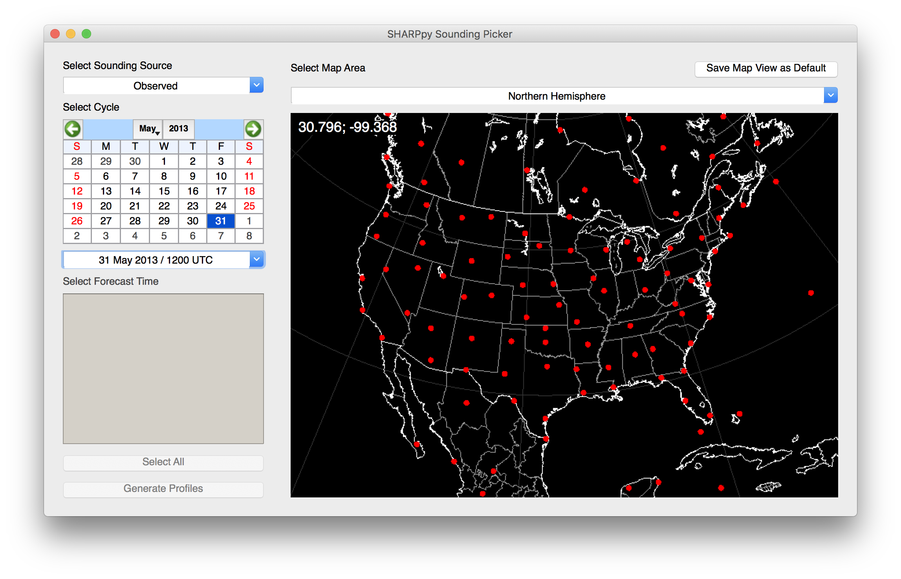

.. _Using_the_Data_Picker_:

Running SHARPpy
===============

Launching the Program
^^^^^^^^^^^^^^^^^^^^^

If you installed the pre-compiled binary, simply double click on the SHARPpy program on your computer.
If you installed from source or from a package manager, navigate to your terminal and type
in the following command into the the command line:

.. prompt:: bash

    sharppy

If the X-window is enabled (most desktops will have this already available), the Sounding Picker should launch.

As mentioned, installing via command line allows the user to access both the libraries for scripting and also the GUI interface.
The following sections will discuss the GUI functionality.  For more information about scripting with SHARPpy see the :ref:`Scripting` page. 

The Sounding Picker
^^^^^^^^^^^^^^^^^^^

Launching the SHARPpy program (from the command line or from the binaries) should load up the SHARPpy Sounding Picker:

   The SHARPpy Sounding Picker window showing the locations where observed sounding data may be examined through the program interface.

The Picker is an interface where the metadata for sounding data sources may be examined in order to help select the sounding data the user wishes to analyze.  In this window, users can select the data source (top left) which includes both observed and modeled sounding datasets.  For each sounding source, a data cycle time can be selected.  For observed data, this will generally be at 00 and 12 UTC.  For modeled data, the data may be available at hourly or synoptic time intervals (e.g., 00, 06, 12, or 18 UTC).  If point forecast soundings are desired by the user from different models (e.g., GFS), the "Select Forecast Time" list will be populated to show the model forecast times available from that model.  This list can be used to load subsets of the model run data into SHARPpy for analysis.  

After the data source and times are selected, the map to the right will be populated with red points indicating the sounding locations available.  While the program does default to U.S. locations, the map can be reoriented by clicking and dragging the map area.  Double clicking on the map will center the map to the cursor location.  Other global maps (e.g., Tropics and Southern Hemisphere) can be selected from the drop down box.  Should you wish to save your map view as the new default map view, you can click the "Save Map View as Default" box in the top right.  Selection of a sounding data site will turn that site green on the map.  Once a sounding data site is selected, you can click "Generate Profiles" to download the data and analyze it in the SHARPpy GUI.    

Default Data Sources
^^^^^^^^^^^^^^^^^^^^

SHARPpy links into various datasets around the web to allow the user to explore a variety of observed and modeling datasets.  Combined, these datasets offer SHARPpy users accessiblity to **over 100 million different sounding data files** directly from the Picker.  Links to these datasets come default with the SHARPpy package and files pointing SHARPpy to these datasets are placed in the user's home directory underneath a directory called `.sharppy/`.  Unless you are attempting to install additional data sources that SHARPpy can read (see :ref:`Custom_Data_Sources`), this folder should not be modified. 

.. csv-table:: Default SHARPpy Data Sources
   :header: "Name", "Link", "Datasets"
   :widths: 20, 50, 15

   "Penn State", "http://www.meteo.psu.edu/bufkit/", "HRRR, GFS, NAM, 3km NAM, SREF, RAP"
   "NOAA SPC","https://www.spc.noaa.gov/exper/soundings/", "Observed U.S. Soundings"
   "SHARP","http://sharp.weather.ou.edu/", "Observed & Archived Int. Soundings"
   "IEM","http://mtarchive.geol.iastate.edu", "GFS, RUC, NAM, NAMNEST, RAP"
 
Currently, both the NOAA SPC and SHARP server datasets are able to offer world-wide observed soundings.  While the SPC server is handled by the meteorologists at the Storm Prediction Center, the SHARPpy development team has been granted server space at the `University of Oklahoma <http://meteorology.ou.edu>`_ to generate various datastreams (e.g. international soundings).  Data from the SHARP server is generated by GEMPAK binaries that merge realtime standard and significant level data accessible `here <http://weather.rap.ucar.edu/upper/Current.rawins>`_.  Archived soundings were downloaded from the publically available `GEMPAK data archive <http://mtarchive.geol.iastate.edu>`_ managed by the `Iowa Environmental Mesonet <https://mesonet.agron.iastate.edu>`_.  Data from this archive starts on January 1st, 1946.  Decoding of this dataset (and the real-time international data stream on SHARP) are performed by the GEMPAK ``snlist`` binary distributed in the `NWS SOO's BUFRgruven package <http://strc.comet.ucar.edu/software/bgruven/>`_. 

The automated processing on the SHARP server attempts to clean up some of the sounding data that is created by ``snlist`` into a format that is suitable for use in SHARPpy.  Sounding files that contain only data above 100 mb (stratospheric profiles) are removed from the archive as they cannot be displayed in the SHARPpy GUI and would break some assumptions inherent in the SHARPpy algorithms about the sounding data.  Most significantly though, this automated processing attempts to remove duplicate data points as they may break the assumption in SHARPpy's interpolation routines that the pressure and height data is monotonically increasing or decreasing.

.. warning::
    While we have taken care to provide accurate data through SHARPpy, errors may occur due to various reasons.  Because of this reason, the users should use this data at their own risk and should take care to scrutinize the data provided.  This data is provided without any warranty of accuracy.   

.. figure:: http://sharp.weather.ou.edu/soundings/obs/recent.png
   :scale: 30%
   :align: center

   A real-time status plot from the SHARP server generated for the last (00 or 12 UTC) sounding dataset available.  Each point indicates a location where sounding data was found on the Unidata stream.  The color of each point indicates the status of the data in the processing steps.  Green data points indicate data files that were able to be generated by the merge script and passed the SHARPpy data integrity checks.  Yellow data points indicate data files that were created, but threw an exception when passed to SHARPpy (likely due to data integrity issues).  Red data points are locations where the merge script failed and are likely due to incomplete data in the Unidata stream.

The data provided by Penn State is provided in the Bufkit format.  The foreast soundings provided within this format are derived directly from the model native vertical grid; no interpolation is performed.  Often, the forecast sounding points are located at stations where METAR observations can be found.  The forecast sounding points have been chosen by the scientists at `NOAA's Environmental Modeling Center <http://www.emc.ncep.noaa.gov>`_ as a part of their mission to support NOAA's mission. Although we are persuing various options for expanding the various sounding points from these models, *we do not have the ability to add more data points*.  The IEM BUFKIT archive provides SHARPpy users Bufkit files for various NCEP models going back to 2010.

.. note::
   The SHARPpy development team has noticed a distinct sensitivity of various SHARPpy algorithms to the post-processing performed on model output.  Particularly, this sensitivity is best noticed when SHARPpy output is compared between model forecast soundings a.) created by interpolated from the model vertical grid to 25-mb pressure levels and b.) those created from the native model vertical grid.  Because of this sensitivity, differences may appear between different SHARPpy output across the web. 

.. warning::
   Occasionally, the default data sources go down in SHARPpy.  With the exception of the SHARP dataset, these issues are largely outside of our control and may often be resolved by trying to access the data again at another time.

Batch Mode
^^^^^^^^^^

If you installed via the command line, the SHARPpy batch mode may be accessible through the :command:`sharppy` command.
In this mode, the Picker and GUI may be bypassed to generate images of the SHARPpy GUI to show your data.

Examples
--------

To generate a plot of the test data included in SHARPpy:

.. prompt:: bash

    sharppy examples/data/14061619.OAX

To generate a plot of the 00 UTC sounding released from Dayton, Ohio during the 1974 Super Outbreak:

.. prompt:: bash

    sharppy --datasource Observed --station DAY --datetime 19740404/00

To learn more about the batch mode commands:

.. prompt:: bash $

    sharppy --help

When things go wrong
^^^^^^^^^^^^^^^^^^^^

Occasionally, bugs arise in programs.  To better understand them and communicate them to others,
the user can use modifier ``--debug`` to turn on logging:

.. prompt:: bash

    sharppy --debug

Logs are stored within the ``~/.sharppy`` folder.  Versioning info may also be output from the :command:`sharppy` commmand:

.. prompt:: bash

    sharppy --version

Versioning is also output when the About box is launched by the user from the program.  These 
tools may be used when debugging the code and `submitting bug reports to Github <https://github.com/sharppy/SHARPpy/issues>`_:

