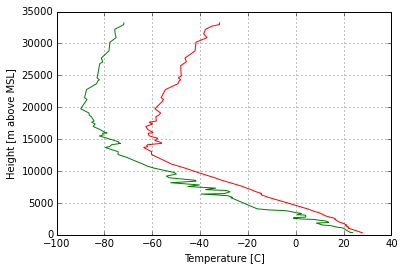
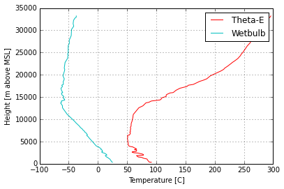
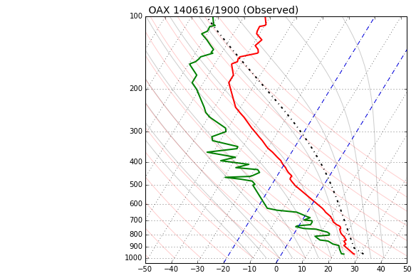

.. _Scripting:

Scripting
=========

This tutorial is meant to teach the user how to directly interact with the SHARPpy libraries using the Python interpreter. This tutorial will cover reading in files into the the Profile object, plotting the data using Matplotlib, and computing various indices from the data. It is also a reference to the different functions and variables SHARPpy has available to the user.

3 Steps to Scripting
^^^^^^^^^^^^^^^^^^^^

For those wishing to run SHARPpy routines using Python scripts, you often will need to perform 3 steps before you can begin running routines.  These three steps read in the data, load in the SHARPpy modules, and convert the data into SHARPpy Profile objects.

Step 1: Load in the modules.
--------------------------------

All of the SHARPpy routines (parcel lifting, composite indices, etc.)
reside within the SHARPTAB module.

SHARPTAB contains 6 modules: params, winds, thermo, utils, interp, fire,
constants, watch\_type

Each module has different functions:

.. parsed-literal::

    interp - interpolates different variables (temperature, dewpoint, wind, etc.) to a specified pressure
    winds - functions used to compute different wind-related variables (shear, helicity, mean winds, storm relative vectors)
    thermo - temperature unit conversions, theta-e, theta, wetbulb, lifting functions
    utils - wind speed unit conversions, wind speed and direction to u and v conversions, QC
    params - computation of different parameters, indices, etc. from the Profile object
    fire - fire weather indices

Below is the code to load in these modules:

.. code:: python

    import sharppy
    import sharppy.sharptab.profile as profile
    import sharppy.sharptab.interp as interp
    import sharppy.sharptab.winds as winds
    import sharppy.sharptab.utils as utils
    import sharppy.sharptab.params as params
    import sharppy.sharptab.thermo as thermo

To learn more about the functions available in SHARPTAB, access the API here: :ref:`modindex`

Step 2: Read in the data.
-------------------------

For this example, the Pilger, NE tornado proximity sounding from 19 UTC within the tutorial/ directory is an example of the SPC sounding file format that can be read in by the GUI. Here we'll read it in manually.

If you want to read in your own data using this function, write a script
to mimic the data format shown in the 14061619.OAX file found in this
directory. Missing values must be -9999.  We'll have to also load in Matplotlib for this example (which comes default with Anaconda)
to plot some of the data.

.. code:: python

    import matplotlib as pyplot.plt
    spc_file = open('14061619.OAX', 'r').read()

Step 3: Make a Profile object.
------------------------------

Before running any analysis routines on the data, we have to create a
Profile object first. A Profile object describes the vertical
thermodynamic and kinematic profiles and is the key object that all
SHARPpy routines need to run. Any data source can be passed into a
Profile object (i.e. radiosonde, RASS, satellite sounding retrievals,
etc.) as long as it has these profiles:

-  temperature (C)
-  dewpoint (C)
-  height (meters above mean sea level)
-  pressure (millibars)
-  wind speed (kts)
-  wind direction (degrees)

or (optional) - zonal wind component U (kts) - meridional wind component
V (kts)

For example, after reading in the data in the example above, a Profile
object can be created. Since this file uses the value -9999 to indicate
missing values, we need to tell SHARPpy to ignore these values in its
calculations by including the missing field to be -9999. In addition, we
tell SHARPpy we want to create a default BasicProfile object. Telling
SHARPpy to create a "convective" profile object instead of a "default"
profile object will generate a Profile object with all of the indices
computed in the SHARPpy GUI. If you are only wanting to compute a few
indices, you probably don't want to do that.

.. code:: python

    import numpy as np
    from StringIO import StringIO
    
    def parseSPC(spc_file):
        """
            This function will read a SPC-style formatted observed sounding file,
            similar to that of the 14061619.OAX file included in the SHARPpy distribution.
            
            It will return the pressure, height, temperature, dewpoint, wind direction and wind speed data
            from that file.
        """
        ## read in the file
        data = np.array([l.strip() for l in spc_file.split('\n')])
    
        ## necessary index points
        title_idx = np.where( data == '%TITLE%')[0][0]
        start_idx = np.where( data == '%RAW%' )[0] + 1
        finish_idx = np.where( data == '%END%')[0]
    
        ## create the plot title
        data_header = data[title_idx + 1].split()
        location = data_header[0]
        time = data_header[1][:11]
    
        ## put it all together for StringIO
        full_data = '\n'.join(data[start_idx : finish_idx][:])
        sound_data = StringIO( full_data )
    
        ## read the data into arrays
        p, h, T, Td, wdir, wspd = np.genfromtxt( sound_data, delimiter=',', comments="%", unpack=True )
    
        return p, h, T, Td, wdir, wspd
    
    pres, hght, tmpc, dwpc, wdir, wspd = parseSPC(spc_file)
    
    prof = profile.create_profile(profile='default', pres=pres, hght=hght, tmpc=tmpc, \
                                        dwpc=dwpc, wspd=wspd, wdir=wdir, missing=-9999, strictQC=True)

.. important::

    In SHARPpy, Profile objects have quality control checks built into them
    to alert the user to bad data and in order to prevent the program from
    crashing on computational routines. For example, upon construction of
    the Profile object, the SHARPpy will check for unrealistic values (i.e.
    dewpoint or temperature below absolute zero, negative wind speeds) and
    incorrect ordering of the height and pressure arrays. Height arrays must
    be increasing with array index, and pressure arrays must be decreasing
    with array index. Repeat values are not allowed.  If you encounter this issue, 
    you can either manually edit the data to
    remove the offending data values or you can avoid these checks by
    setting the "strictQC" flag to False when constructing an object.

.. tip::
    Because Python is an interpreted language, it can be quite slow for
    certain processes. When working with soundings in SHARPpy, we recommend
    the profiles contain a maximum of 200-500 points. High resolution
    radiosonde profiles (i.e. 1 second profiles) contain thousands of points
    and some of the SHARPpy functions that involve lifting parcels (i.e.
    parcelx) may take a long time to run. To filter your data to make it
    easier for SHARPpy to work with, you can use a sounding filter such as
    the one found here:

    https://github.com/tsupinie/SoundingFilter

Viewing the Profiles
^^^^^^^^^^^^^^^^^^^^^

Data can be plotted using Matplotlib by accessing the attributes of the Profile object.  Below is an example of
Python code plotting the temperature and dewpoint profiles with height:

.. code:: python

    import matplotlib.pyplot as plt
    plt.plot(prof.tmpc, prof.hght, 'r-')
    plt.plot(prof.dwpc, prof.hght, 'g-')
    #plt.barbs(40*np.ones(len(prof.hght)), prof.hght, prof.u, prof.v)
    plt.xlabel("Temperature [C]")
    plt.ylabel("Height [m above MSL]")
    plt.grid()
    plt.show()

SHARPpy Profile objects keep track of the height grid the profile lies
on. Within the profile object, the height grid is assumed to be in
meters above mean sea level.

In the example data provided, the profile can be converted to and from
AGL from MSL:

.. code:: python

    msl_hght = prof.hght[prof.sfc] # Grab the surface height value
    print("SURFACE HEIGHT (m MSL):",msl_hght)
    agl_hght = interp.to_agl(prof, msl_hght) # Converts to AGL
    print("SURFACE HEIGHT (m AGL):", agl_hght)
    msl_hght = interp.to_msl(prof, agl_hght) # Converts to MSL
    print("SURFACE HEIGHT (m MSL):",msl_hght)

.. parsed-literal::

    SURFACE HEIGHT (m MSL): 350.0
    SURFACE HEIGHT (m AGL): 0.0
    SURFACE HEIGHT (m MSL): 350.0

By default, Profile objects also create derived profiles such as Theta-E
and Wet-Bulb when they are constructed. These profiles are accessible to
the user too.

.. code:: python

    plt.plot(thermo.ktoc(prof.thetae), prof.hght, 'r-', label='Theta-E')
    plt.plot(prof.wetbulb, prof.hght, 'c-', label='Wetbulb')
    plt.xlabel("Temperature [C]")
    plt.ylabel("Height [m above MSL]")
    plt.legend()
    plt.grid()
    plt.show()

Lifting parcels
^^^^^^^^^^^^^^^

In SHARPpy, parcels are lifted via the params.parcelx() routine. The
parcelx() routine takes in the arguments of a Profile object and a flag
to indicate what type of parcel you would like to be lifted. Additional
arguments can allow for custom/user defined parcels to be passed to the
parcelx() routine, however most users will likely be using only the
Most-Unstable, Surface, 100 mb Mean Layer, and Forecast parcels.

The parcelx() routine by default utilizes the virtual temperature
correction to compute variables such as CAPE and CIN. If the dewpoint
profile contains missing data, parcelx() will disregard using the
virtual temperature correction.

.. code:: python

    sfcpcl = params.parcelx( prof, flag=1 ) # Surface Parcel
    fcstpcl = params.parcelx( prof, flag=2 ) # Forecast Parcel
    mupcl = params.parcelx( prof, flag=3 ) # Most-Unstable Parcel
    mlpcl = params.parcelx( prof, flag=4 ) # 100 mb Mean Layer Parcel

Once your parcel attributes are computed by params.parcelx(), you can
extract information about the parcel such as CAPE, CIN, LFC height, LCL
height, EL height, etc.  We will do this for the Most Unstable parcel ``mupcl``.

.. code:: python

    print("Most-Unstable CAPE:", mupcl.bplus) # J/kg
    print("Most-Unstable CIN:", mupcl.bminus) # J/kg
    print("Most-Unstable LCL:", mupcl.lclhght) # meters AGL
    print("Most-Unstable LFC:", mupcl.lfchght) # meters AGL
    print("Most-Unstable EL:", mupcl.elhght) # meters AGL
    print("Most-Unstable LI:", mupcl.li5) # C

This code outputs the following text:

.. parsed-literal::

    Most-Unstable CAPE: 5769.22545311
    Most-Unstable CIN: -0.644692447001
    Most-Unstable LCL: 512.718558828
    Most-Unstable LFC: 612.53643485
    Most-Unstable EL: 13882.5821154
    Most-Unstable LI: -13.8145334959

Other Parcel Object Attributes
~~~~~~~~~~~~~~~~~~~~~~~~~~~~~~

The six indices listed above are not the only ones calculated by
parcelx(). Other indices can be calculated and accessed too:

Here is a list of the attributes and their units contained in each
parcel object (pcl):

::

    pcl.pres - Parcel beginning pressure (mb)
    pcl.tmpc - Parcel beginning temperature (C)
    pcl.dwpc - Parcel beginning dewpoint (C)
    pcl.ptrace - Parcel trace pressure (mb)
    pcl.ttrace - Parcel trace temperature (C)
    pcl.blayer - Pressure of the bottom of the layer the parcel is lifted (mb)
    pcl.tlayer - Pressure of the top of the layer the parcel is lifted (mb)
    pcl.lclpres - Parcel LCL (lifted condensation level) pressure (mb)
    pcl.lclhght - Parcel LCL height (m AGL)
    pcl.lfcpres - Parcel LFC (level of free convection) pressure (mb)
    pcl.lfchght - Parcel LFC height (m AGL)
    pcl.elpres - Parcel EL (equilibrium level) pressure (mb)
    pcl.elhght - Parcel EL height (m AGL)
    pcl.mplpres - Maximum Parcel Level (mb)
    pcl.mplhght - Maximum Parcel Level (m AGL)
    pcl.bplus - Parcel CAPE (J/kg)
    pcl.bminus - Parcel CIN (J/kg)
    pcl.bfzl - Parcel CAPE up to freezing level (J/kg)
    pcl.b3km - Parcel CAPE up to 3 km (J/kg)
    pcl.b6km - Parcel CAPE up to 6 km (J/kg)
    pcl.p0c - Pressure value at 0 C  (mb)
    pcl.pm10c - Pressure value at -10 C (mb)
    pcl.pm20c - Pressure value at -20 C (mb)
    pcl.pm30c - Pressure value at -30 C (mb)
    pcl.hght0c - Height value at 0 C (m AGL)
    pcl.hghtm10c - Height value at -10 C (m AGL)
    pcl.hghtm20c - Height value at -20 C (m AGL)
    pcl.hghtm30c - Height value at -30 C (m AGL)
    pcl.wm10c - Wet bulb velocity at -10 C 
    pcl.wm20c - Wet bulb velocity at -20 C
    pcl.wm30c - Wet bulb at -30 C
    pcl.li5 = - Lifted Index at 500 mb (C)
    pcl.li3 = - Lifted Index at 300 mb (C)
    pcl.brnshear - Bulk Richardson Number Shear
    pcl.brnu - Bulk Richardson Number U (kts)
    pcl.brnv - Bulk Richardson Number V (kts)
    pcl.brn - Bulk Richardson Number (unitless)
    pcl.limax - Maximum Lifted Index (C)
    pcl.limaxpres - Pressure at Maximum Lifted Index (mb)
    pcl.cap - Cap Strength (C)
    pcl.cappres - Cap strength pressure (mb)
    pcl.bmin - Buoyancy minimum in profile (C)
    pcl.bminpres - Buoyancy minimum pressure (mb)

Calculating kinematic indicies
^^^^^^^^^^^^^^^^^^^^^^^^^^^^^^^

SHARPpy also allows the user to compute kinematic variables such as
shear, mean-winds, and storm relative helicity. SHARPpy will also
compute storm motion vectors based off of the work by Stephen Corfidi
and Matthew Bunkers. Below is some example code to compute the
following:

1. 0-3 km Pressure-Weighted Mean Wind
2. 0-6 km Shear (kts)
3. Bunker's Storm Motion (right-mover) (Bunkers et al. 2014 version)
4. Bunker's Storm Motion (left-mover) (Bunkers et al. 2014 version)
5. 0-3 km Storm Relative Helicity

.. code:: python

    # Find the pressure values that correspond to the surface, 1 km, 3 km and 6 km levels.
    sfc = prof.pres[prof.sfc]
    p3km = interp.pres(prof, interp.to_msl(prof, 3000.))
    p6km = interp.pres(prof, interp.to_msl(prof, 6000.))
    p1km = interp.pres(prof, interp.to_msl(prof, 1000.))
    
    # Calculate the 0-3 km pressure-weighted mean wind
    mean_3km = winds.mean_wind(prof, pbot=sfc, ptop=p3km)
    print("0-3 km Pressure-Weighted Mean Wind (kt):", utils.comp2vec(mean_3km[0], mean_3km[1])[1])
    
    # Calculate the 0-1, 0-3, and 0-6 km wind shear
    sfc_6km_shear = winds.wind_shear(prof, pbot=sfc, ptop=p6km)
    sfc_3km_shear = winds.wind_shear(prof, pbot=sfc, ptop=p3km)
    sfc_1km_shear = winds.wind_shear(prof, pbot=sfc, ptop=p1km)
    print("0-6 km Shear (kt):", utils.comp2vec(sfc_6km_shear[0], sfc_6km_shear[1])[1])
    
    # Calculate the Bunkers Storm Motion Left and Right mover vectors (these are returned in u,v space
    # so let's transform them into wind speed and direction space.)
    srwind = params.bunkers_storm_motion(prof)
    print("Bunker's Storm Motion (right-mover) [deg,kts]:", utils.comp2vec(srwind[0], srwind[1]))
    print("Bunker's Storm Motion (left-mover) [deg,kts]:", utils.comp2vec(srwind[2], srwind[3]))
    
    # Calculate the storm-relative helicity using the right-movers 
    srh3km = winds.helicity(prof, 0, 3000., stu = srwind[0], stv = srwind[1])
    srh1km = winds.helicity(prof, 0, 1000., stu = srwind[0], stv = srwind[1])
    print("0-3 km Storm Relative Helicity [m2/s2]:",srh3km[0])

This code outputs the following text:

.. parsed-literal::

    0-3 km Pressure-Weighted Mean Wind (kt): 41.1397595603
    0-6 km Shear (kt): 55.9608928026
    Bunker's Storm Motion (right-mover) [deg,kts]: (masked_array(data = 225.652934838,
                 mask = False,
           fill_value = -9999.0)
    , 27.240749559186799)
    Bunker's Storm Motion (left-mover) [deg,kts]: (masked_array(data = 204.774711769,
                 mask = False,
           fill_value = -9999.0)
    , 52.946150880598658)
    0-3 km Storm Relative Helicity [m2/s2]: 584.016767705

Calculating other indices
^^^^^^^^^^^^^^^^^^^^^^^^^

The effective inflow layer is occasionally used to derive other variables that 
may be used to explain a storm's behavior.  Here are a few examples of
how to compute variables that require the effective inflow layer in
order to calculate them:

.. code:: python

    # Let's calculate the effective inflow layer and print out the heights of the top
    # and bottom of the layer.  We'll have to convert it from m MSL to m AGL.
    eff_inflow = params.effective_inflow_layer(prof)
    ebot_hght = interp.to_agl(prof, interp.hght(prof, eff_inflow[0]))
    etop_hght = interp.to_agl(prof, interp.hght(prof, eff_inflow[1]))
    print("Effective Inflow Layer Bottom Height (m AGL):", ebot_hght)
    print("Effective Inflow Layer Top Height (m AGL):", etop_hght)
    
    # Like before, we can calculate the storm-relative helicity, but let's do it for the effective inflow layer.
    effective_srh = winds.helicity(prof, ebot_hght, etop_hght, stu = srwind[0], stv = srwind[1])
    print("Effective Inflow Layer SRH (m2/s2):", effective_srh[0])
    
    # We can also calculate the Effective Bulk Wind Difference using the wind shear calculation and the inflow layer.
    ebwd = winds.wind_shear(prof, pbot=eff_inflow[0], ptop=eff_inflow[1])
    ebwspd = utils.mag( ebwd[0], ebwd[1] )
    print("Effective Bulk Wind Difference:", ebwspd)
    
    # Composite indices (e.g. STP, SCP, SHIP) can be calculated after determining the effective inflow layer.
    scp = params.scp(mupcl.bplus, effective_srh[0], ebwspd)
    stp_cin = params.stp_cin(mlpcl.bplus, effective_srh[0], ebwspd, mlpcl.lclhght, mlpcl.bminus)
    stp_fixed = params.stp_fixed(sfcpcl.bplus, sfcpcl.lclhght, srh1km[0], utils.comp2vec(sfc_6km_shear[0], sfc_6km_shear[1])[1])
    ship = params.ship(prof)
    print("Supercell Composite Parameter:", scp)
    print("Significant Tornado Parameter (w/CIN):", stp_cin)
    print("Significant Tornado Parameter (fixed):", stp_fixed)
    print("Significant Hail Parameter:", ship)

This code then will output this text:

.. parsed-literal::

    Effective Inflow Layer Bottom Height (m AGL): 0.0
    Effective Inflow Layer Top Height (m AGL): 2117.98
    Effective Inflow Layer SRH (m2/s2): 527.913472562
    Effective Bulk Wind Difference: 43.3474336034
    Supercell Composite Parameter: 60.9130368589
    Significant Tornado Parameter (w/CIN): 13.8733427141
    Significant Tornado Parameter (fixed): 13.6576402964

Plotting a Skew-T using Matplotlib
^^^^^^^^^^^^^^^^^^^^^^^^^^^^^^^^^^

Now, let's try to plot the data on a Skew-T. You may want to do this if
you're looking to create a plot for use in a publication.

First, we need to tell Matplotlib (the Python plotting package) that
we'd like a Skew-T style plot. This can be done by using the code found at:
http://matplotlib.org/examples/api/skewt.html

Now that Matplotlib knows about the Skew-T style plot, let's plot the
OAX sounding data on a Skew-T and show the Most-Unstable parcel
trace. Let's also include dry adiabats and moist adiabats for the user.

.. code:: python
 
    # Create a new figure. The dimensions here give a good aspect ratio
    import sharppy.plot.skew as skew
    fig = plt.figure(figsize=(6.5875, 6.2125))
    ax = fig.add_subplot(111, projection='skewx')
    ax.grid(True)
 
    # Select the Most-Unstable parcel (this can be changed)
    pcl = mupcl
    
    # Let's set the y-axis bounds of the plot.
    pmax = 1000
    pmin = 10
    dp = -10
    presvals = np.arange(int(pmax), int(pmin)+dp, dp)
    
    # plot the moist-adiabats at surface temperatures -10 C to 45 C at 5 degree intervals.
    for t in np.arange(-10,45,5):
        tw = []
        for p in presvals:
            tw.append(thermo.wetlift(1000., t, p))
        # Plot the moist-adiabat with a black line that is faded a bit.
        ax.semilogy(tw, presvals, 'k-', alpha=.2)
    
    # A function to calculate the dry adiabats
    def thetas(theta, presvals):
        return ((theta + thermo.ZEROCNK) / (np.power((1000. / presvals),thermo.ROCP))) - thermo.ZEROCNK
    
    # plot the dry adiabats
    for t in np.arange(-50,110,10):
        ax.semilogy(thetas(t, presvals), presvals, 'r-', alpha=.2)
    
    # plot the title.
    plt.title(' OAX 140616/1900 (Observed)', fontsize=14, loc='left')
    
    # Plot the data using normal plotting functions, in this case using
    # log scaling in Y, as dicatated by the typical meteorological plot
    ax.semilogy(prof.tmpc, prof.pres, 'r', lw=2)
    ax.semilogy(prof.dwpc, prof.pres, 'g', lw=2)
    
    # Plot the parcel trace.
    ax.semilogy(pcl.ttrace, pcl.ptrace, 'k-.', lw=2)
    
    # Denote the 0 to -20 C area on the Skew-T.
    l = ax.axvline(0, color='b', linestyle='--')
    l = ax.axvline(-20, color='b', linestyle='--')
    
    # Set the log-scale formatting and label the y-axis tick marks.
    ax.yaxis.set_major_formatter(plt.ScalarFormatter())
    ax.set_yticks(np.linspace(100,1000,10))
    ax.set_ylim(1050,100)
    
    # Label the x-axis tick marks.
    ax.xaxis.set_major_locator(plt.MultipleLocator(10))
    ax.set_xlim(-50,50)
    
    # Show the plot to the user.
    # plt.savefig('skewt.png', bbox_inches='tight') # saves the plot to the disk.
    plt.show()

